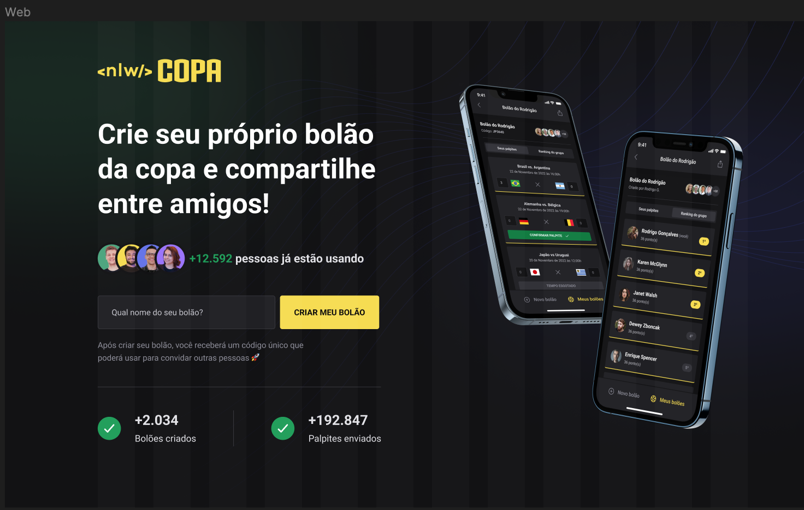

<h1 align="center"> PAGINA DE CADASTRO BOLÃO </h1>

Desenvolvido em conjunto com 
Rocketseat.

https://www.rocketseat.com.br/

  <a href="#-tecnologias">Tecnologias</a>&nbsp;&nbsp;&nbsp;|&nbsp;&nbsp;&nbsp;
  <a href="#-projeto">Projeto</a>&nbsp;&nbsp;&nbsp;|&nbsp;&nbsp;&nbsp;
  <a href="#-layout">Layout</a>&nbsp;&nbsp;&nbsp;|&nbsp;&nbsp;&nbsp;
  <a href="#memo-licença">Licença</a>

  

 

  

## 🚀 Tecnologias

Esse projeto foi desenvolvido com as seguintes tecnologias:

- HTML
- CSS com Twind
- JavaScript
- Git e Github

## 💻 Projeto

Pagina de cadastro para umm app de bolão.

## 🔖 Layout

Você pode visualizar o layout do projeto através [DESSE LINK](https://www.figma.com/file/bX9R4cFbjgqeee5hx6Z8ZS/Bol%C3%A3o-da-Copa-(Community)?node-id=0%3A1&t=cJw775Hguay6f9oz-0). É necessário ter conta no [Figma](https://figma.com) para acessá-lo.

## :memo: Licença

Esse projeto está sob a licença MIT.

---
